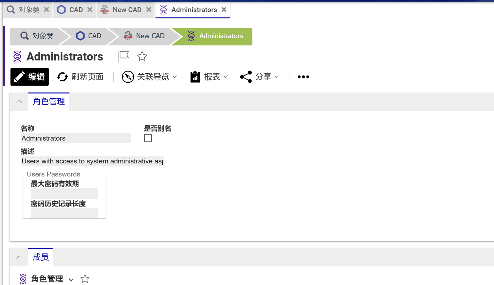

# 面包屑导航

Aras Innovator面包屑导航功能,开启对象页面后会在顶部展示当前页面来源路径,点击导航节点可跳转至其它对象页面

## 支持系统版本
Aras Innovator Version 22  Build: 14.0.8.35675

## 安装

#### 提醒!
**请提前备份数据库与CodeTree**

### 必备条件

1. Aras Innovator 已安装 (version 22)
2. Aras Package Import 导入工具

#### Code tree 安装步骤

1. 备份您的CodeTree并存储在安全的地方
2. 打开本地 `..\BreadcrumbNavigation\` 文件夹
3. 复制 `\Innovator\` 文件夹
4. 将其粘贴到安装目录的根目录
    + 默认情况下路径为 `C:\Program Files\Aras\Innovator\`

#### Database 安装步骤

1. 备份您的数据库并将BAK文件存储在安全的地方
2. 打开 Aras Package Import 工具
3. 输入Aras Innovator系统地址并点击 **Login**
4. 在弹出的登录页面中输入登录信息
4. 在 **TargetRelease** 控件中输入**包**的名称(可随意填写,建议填写 `BreadcrumbNavigation`)
    * 可选: 在 **Description** 控件中描述信息
5. 在 **Path** 控件中输入本地安装包路径 `..\BreadcrumbNavigation\Imports\breadcrumbs.mf` 
6. 在 **Available for Import** 控件中勾选 **breadcrumbs**
7. 选择 Type = **Merge** , Mode = **Thorough Mode**
8. 点击顶部左侧 **Import**
9. 等待导入成功后关闭 Aras Package Import 工具

####

现在您可以访问系统并使用面包屑导航功能了

## 技术交流 📣
[QQ群:197823386](http://qm.qq.com/cgi-bin/qm/qr?_wv=1027&k=9QBAR-Ra85m9l3GUxCX49rRFPWLs87FG&authKey=kdr98tqLBx2rF5swIO5%2BiKGQRJdLt8DZ5t2sSHY8pWfHhmjAioXEfWJfs4wShNfJ&noverify=0&group_code=197823386)

